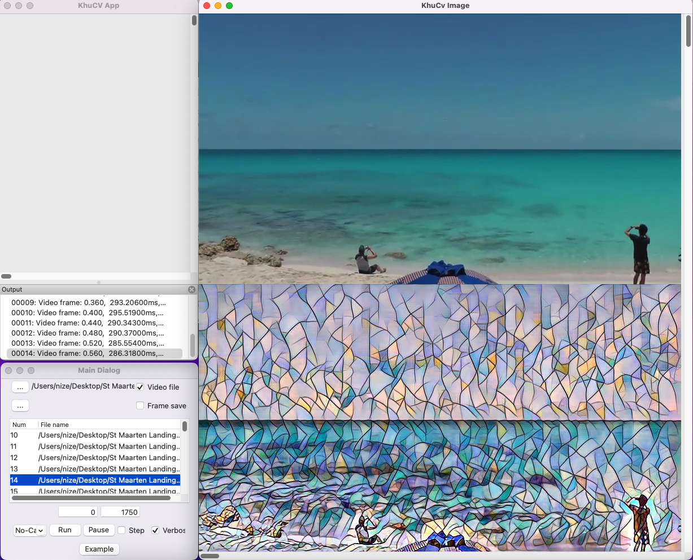

# Style transfer example
* Using OpenCV (cv::dnn)
* Model: https://github.com/onnx/models/tree/main/vision/style_transfer/fast_neural_style

## Project.h
``` C++
class CProject {
  // ...
	cv::dnn::Net m_DnnModel;  // OpenCV dnn::Net
};
```

## Project.cpp
``` C++
void CProject::Run(cv::Mat Input, cv::Mat& Output, bool bFirstRun, bool bVerbose) {
	if(bFirstRun) {
		char ModelPath[256];
		strcpy(ModelPath, m_ExePath);
		strcat(ModelPath, "/mosaic-9.onnx"); // onnx model files: https://github.com/onnx/models/tree/main/vision/style_transfer/fast_neural_style

		m_DnnModel = cv::dnn::readNetFromONNX(ModelPath);
	}

	cv::Mat DnnInput;
	int nW = Input.cols;
	int nH = Input.rows;
	cv::Mat inputBlob = cv::dnn::blobFromImage(Input, 1., cv::Size(nW, nH), cv::Scalar(128,128,128), false);
	m_DnnModel.setInput(inputBlob);

	cv::Mat ResultMat = m_DnnModel.forward();  // Output matrix is 4-D (1*3*nH*nW)

	cv::Mat OutImageBGR[3];

	for(int i = 0 ; i < 3 ; ++i) {
		OutImageBGR[i] = cv::Mat(nH, nW, CV_32FC1);

		int nNewW = (nW+3)/4*4;  // 4bytes aligned 

		for(int y = 0 ; y < nH ; ++y) {
			memcpy((float *)(OutImageBGR[i].data)+nW*y, (float *)(ResultMat.data) + nNewW*nH*i + nNewW*y, nW*sizeof(float));

			for(int x = 0 ; x < nW ; ++x) {
				float *data = ((float *)(OutImageBGR[i].data)+nW*y + x);
				if(*data < 0) *data = 0;
				else if(*data > 255) *data = 255;
			}
		}
	}

	cv::Mat OutImage;

	cv::merge(OutImageBGR, 3, OutImage);

	if(bVerbose) 
		DisplayImage(OutImage, 0, nH, false, true);
}
```

[Result]
</img>   

## References
* Fast Neural Style Transfer: https://github.com/onnx/models/tree/main/vision/style_transfer/fast_neural_style
* The Common Objects in Context (COCO) images and Title-based Video Summarization (TVSum)/SumMe video files are used for demonstration.
* https://cocodataset.org/
* http://people.csail.mit.edu/yalesong/tvsum/
* https://gyglim.github.io/me/vsum/index.html
