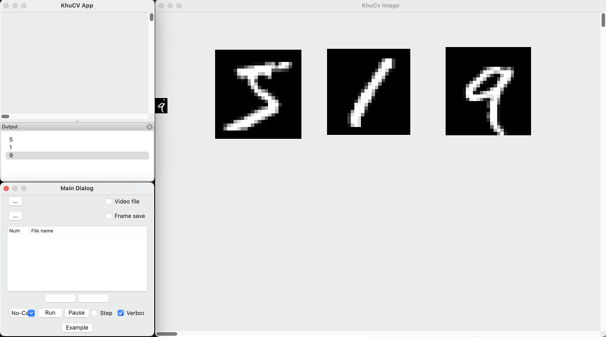

# MNIST classification example
* Using onnx runtime
* Model: https://github.com/onnx/models/tree/main/vision/classification/mnist/model mnist-7.onnx

## Download and setting onnx runtime
* Download file for your environment from https://github.com/microsoft/onnxruntime/releases, and extract
* Windows (+Visual Studio): add include path and lib file
* Linux/Mac 
  + CMakeLists.txt: add include_directories and so/dyLib (Mac: ctrl-open to dyLib)
 
## Project.h
``` C++
#include <onnxruntime_cxx_api.h>

template <typename T>
static void softmax(T& input) {
    float rowmax = *std::max_element(input.begin(), input.end());
    std::vector<float> y(input.size());
    float sum = 0.0f;
    for (size_t i = 0; i != input.size(); ++i) {
        sum += y[i] = std::exp(input[i] - rowmax);
    }
    for (size_t i = 0; i != input.size(); ++i) {
        input[i] = y[i] / sum;
    }
}

struct MNIST {
    MNIST(ORTCHAR_T *pModelPath) : session_{env, pModelPath, Ort::SessionOptions{nullptr}} {
        auto memory_info = Ort::MemoryInfo::CreateCpu(OrtDeviceAllocator, OrtMemTypeCPU);
        input_tensor_ = Ort::Value::CreateTensor<float>(memory_info, input_image_.data(), input_image_.size(), input_shape_.data(), input_shape_.size());
        output_tensor_ = Ort::Value::CreateTensor<float>(memory_info, results_.data(), results_.size(), output_shape_.data(), output_shape_.size());
    }

    std::ptrdiff_t Run() {
        const char* input_names[] = {"Input3"};
        const char* output_names[] = {"Plus214_Output_0"};

        session_.Run(Ort::RunOptions{nullptr}, input_names, &input_tensor_, 1, output_names, &output_tensor_, 1);
        softmax(results_);
        result_ = std::distance(results_.begin(), std::max_element(results_.begin(), results_.end()));
        return result_;
    }

    static constexpr const int width_ = 28;
    static constexpr const int height_ = 28;

    std::array<float, width_ * height_> input_image_{};
    std::array<float, 10> results_{};
    int64_t result_{0};

private:
    Ort::Env env;
    Ort::Session session_;

    Ort::Value input_tensor_{nullptr};
    std::array<int64_t, 4> input_shape_{1, 1, width_, height_};

    Ort::Value output_tensor_{nullptr};
    std::array<int64_t, 2> output_shape_{1, 10};
};
// Source code: https://github.com/microsoft/onnxruntime-inference-examples

class CProject {
...
    
    MNIST *m_pMnist;
};
```

## Porject.cpp
``` C++
CProject::CProject() {
	GetExecutionPath();
    
#ifdef _MSC_VER
    wchar_t MNistPath[256];
    wcscpy(MNistPath, m_ExePathUnicode);
    wcscat(MNistPath, "/mnist-7.onnx");
#else
    char MNistPath[256];
    strcpy(MNistPath, m_ExePath);
    strcat(MNistPath, "/mnist-7.onnx");
#endif
    m_pMnist = new MNIST(MNistPath);
}

CProject::~CProject() {
    delete m_pMnist;
}

void CProject::Run(cv::Mat Input, cv::Mat& Output, bool bFirstRun, bool bVerbose) {
    cv::Mat ResizeInput, DnnInput;
    cv::resize(Input, ResizeInput, cv::Size(28, 28), 0, 0, cv::INTER_AREA);
    cv::cvtColor(ResizeInput, ResizeInput, cv::COLOR_BGR2GRAY);
    ResizeInput.convertTo(DnnInput, CV_32FC1, 1./255, 0);
    
    if (bVerbose) DisplayImage(DnnInput, 0, Input.rows, false, true);
    
    float* input = m_pMnist->input_image_.data();

    memcpy(input, DnnInput.data, sizeof(float)*28*28);

    m_pMnist->Run();
    
    DlgPrintf("%d", m_pMnist->result_);
}
```

## MainDialog.cpp
``` C++
void CMainDialog::OnExample(wxCommandEvent& event) {
	CKcImage kcImage = GetLastSelImage();
	if (kcImage.cvImage.empty()) return;

	cv::Mat cvImage = kcImage.cvImage.clone();
    
  cv::Mat Output;

  m_Project.Run(cvImage, Output, false, m_pVerboseCheck->GetValue());
}
```
[Result]
</img>   
: Select an image and click "Example" button

## References
* Fast Neural Style Transfer: https://github.com/onnx/models/tree/main/vision/style_transfer/fast_neural_style
* The Common Objects in Context (COCO) images and Title-based Video Summarization (TVSum)/SumMe video files are used for demonstration.
* https://cocodataset.org/
* http://people.csail.mit.edu/yalesong/tvsum/
* https://gyglim.github.io/me/vsum/index.html
