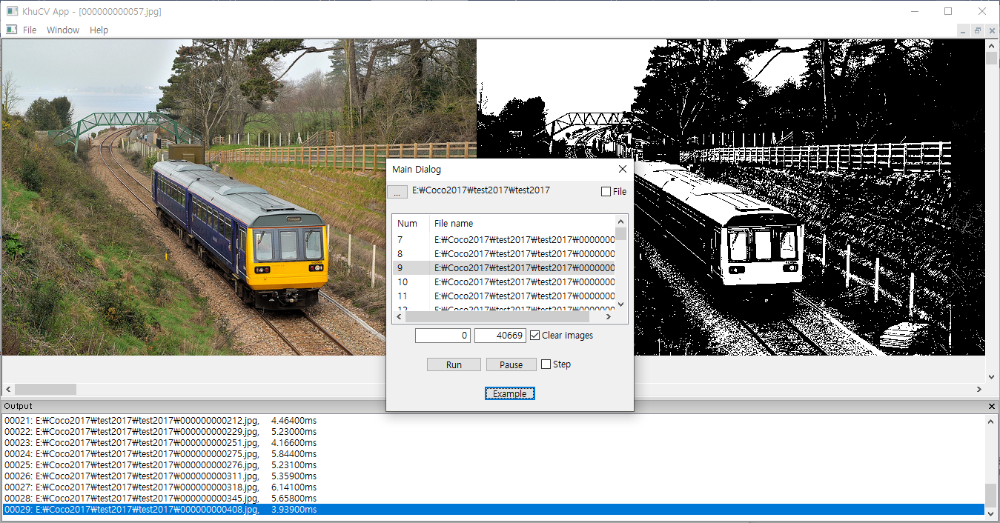
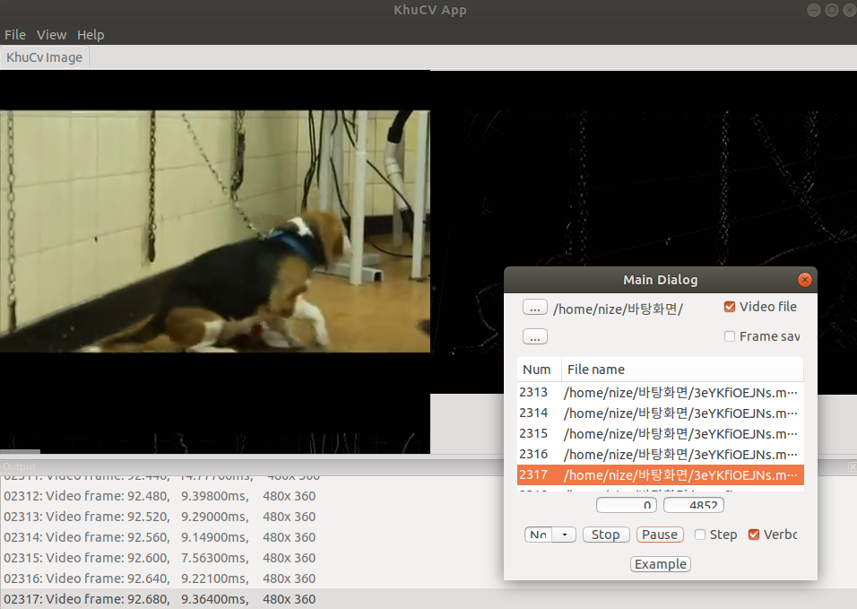
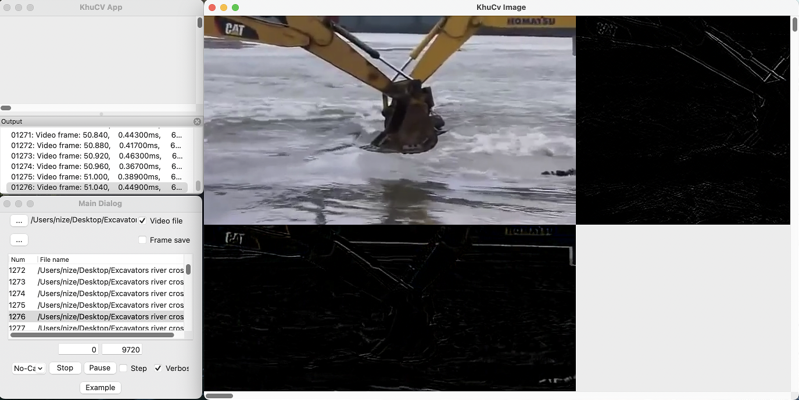

# KhuCv
* KhuCv: Open development source for computer vision  (Kyung Hee University, Data Analysis & Vision Intelligence)
* C++ (wxWidgets + OpenCV)

## Introduction
* Open program sources
* wxWidgets 3.x + OpenCV 4.x
* File open by OpenCV
* File save by OpenCV (individual image)
* Images can be displayed any position and can be moved by mouse
* Strings can be written to Output window (list box)
* Sequence processing (webcam, image sequence, video file)

## Environment setting
* wxWidgets 3.x
  + Windows (+Visual Studio)
    - Download wxWidgets source code from https://www.wxwidgets.org/downloads/
    - Open wxWidgets-x.x.x/build/msw/wx_vcxx.sin with Visual Studio and build
  + Linux (Ubuntu) 
    - Download wxWidgets source code from https://www.wxwidgets.org/downloads/
    - $ sudo apt install libgtk-3-dev
    - $ mkdir build-gtk
    - $ cd build-gtk
    - $ ../configure --with-gtk
    - $ make
    - $ sudo make install
    - $ sudo ldconfig
    - $ cd smaples
    - $ make
    - $cd ../demos
    - $make
  + Mac
    - Download wxWidgets source code from https://www.wxwidgets.org/downloads/
    - $ mkdir build-cocoa				
    - [$ mkdir build-cocoa-debug]
    - $ cd build-cocoa					
    - [$ cd build-cocoa-debug]
    - $ ../configure --with-macosx-version-min		
    - [$ ../configure –-enable-debug --with-macosx-version-min]
    - $ make
    - $ sudo su
    - make install
    - exit
    - $ cd smaples
    - $ make
    - $cd ../demos
    - $make

* OpenCV 4.x
  + Windows (+Visual Studio)
    - Download release files form https://opencv.org/releases/ and extract files
  + Linux (Ubuntu) 
    - $ sudo apt update && sudo apt install -y cmake g++ wget unzip
    - $ sudo apt-get install ffmpeg
    - $ git clone https://github.com/opencv/opencv.git
    - $ git clone https://github.com/opencv/opencv_contrib.git
    - $ mkdir -p build && cd build
    - $ cmake -D OPENCV_EXTRA_MODULES_PATH=../opencv_contrib/modules ../opencv
    - $ cmake --build .    
    - $ sudo make install 
    - $ make
  + Mac
    - $ /bin/bash -c "$(curl -fsSL https://raw.githubusercontent.com/Homebrew/install/master/install.sh)"
    - $ brew install cmake
    - $ brew install ffmpeg@4
    - $ brew link ffmpeg@4
    - $ mkdir opencv
    - $ cd opencv
    - $ git clone https://github.com/opencv/opencv.git
    - $ git clone https://github.com/opencv/opencv_contrib.git
    - $ mkdir build
    - $ cd build
    - $ cmake -D BUILD_OPENEXR=ON -D WITH_FFMPEG=ON -D OPENCV_EXTRA_MODULES_PATH=../opencv_contrib/modules ../opencv
    - $ cmake --build .    
    - $ sudo make install 
    - $ make
    
* Build
  + Windows (+Visual Studio)
    - Make new desktop empty project
    - Add source/header files 
    - Add Include and library paths
    - Add opencv_world4xx.lib to Additional Dependencies
    - Build
    - [OR]
    - Run "Developer Command Prompt for VS 20XX"
    - $ cd build-windows
    - $ cmake . -A x64 -T host=x64  -DWX_ROOTDIR=[DIR] -DOPENCV_ROOTDIR=[DIR]
    -    ex. cmake . -A x64 -T host=x64  -DWX_ROOTDIR="G:/Cpp_Libs/wxWidgets/wxWidgets-3.1.6" -DOPENCV_ROOTDIR="G:/Cpp_Libs/OpenCV/OpenCV_64/install"
    -    ex. cmake . -A x64 -T host=x64  -DWX_ROOTDIR="G:/Cpp_Libs/wxWidgets/wxWidgets-3.1.6" -DOPENCV_ROOTDIR="G:/Cpp_Libs/OpenCV/build"
    - $ msbuild KhuCv.vcxproj /p:configuration=release /p:platform=x64 /p:CharacterSet=Unicode 
  + Linux (Ubuntu) 
    - $ cd build-linux
    - $ cmake .
    - $ make
  + Mac
    - $ cd build-mac
    - $ cmake .
    - $ make

[Windows]
</img>

[Linux-Ubuntu]
</img> 

[Mac]
</img>    
    
## Sequence processing
* Image sequences and video files
* **Example**
  + Open mp4 file and Run
<br></img>  

## Source code
* Call a method (Run) for image processing
``` C++
// MainDialog.cpp
void CMainDialog::OnTimer(wxTimerEvent& event) {
	// Timer for sequence processing

	...

	if(bLoaded) {
		auto start = std::chrono::steady_clock::now();
		
		cv::Mat Output;
		
		// Project Run;
		m_Project.Run(CurrentImage, Output, m_pVerboseCheck->GetValue());
    		// m_Porject is a CProject class instance for sequence processing
   		// Since you only modify the CProject class, you can easily show and debug the processing and results
    
   		// Display codes
		...
	}

	...
}
```

* CProject class
``` C++
// CProcessing.cpp / h
class CProject
{
	cv::Mat m_PreviousImage;
public:
	CProject();
	void Run(cv::Mat Input, cv::Mat& Output, bool bVerbose);
};

CProject::CProject() {
}

void CProject::Run(cv::Mat Input, cv::Mat& Output, bool bVerbose) {
	cv::Sobel(Input, Output, -1, 1, 1);

	cv::Mat Difference;

	if (!m_PreviousImage.empty()) {

		if (Input.type() == m_PreviousImage.type() &&
			Input.cols == m_PreviousImage.cols &&
			Input.rows == m_PreviousImage.rows) {
			cv::subtract(Input, m_PreviousImage, Difference);

			if (bVerbose) DisplayImage(Difference, 0, Input.rows, false, false);
		}
	}

	m_PreviousImage = Input.clone();
}
```

* Showing string information (DlgPrintf function) - lower output window
``` C++
DlgPrintf("%05d: %s, %10.5lfms", m_nProcessingNum, fileName, processingTime);
```

## References
* The Common Objects in Context (COCO) images and Title-based Video Summarization (TVSum)/SumMe video files are used for demonstration.
* https://cocodataset.org/
* http://people.csail.mit.edu/yalesong/tvsum/
* https://gyglim.github.io/me/vsum/index.html
* Intstall wxWidgets: https://www.cs.sjsu.edu/~mak/tutorials/InstallwxWidgets.pdf
