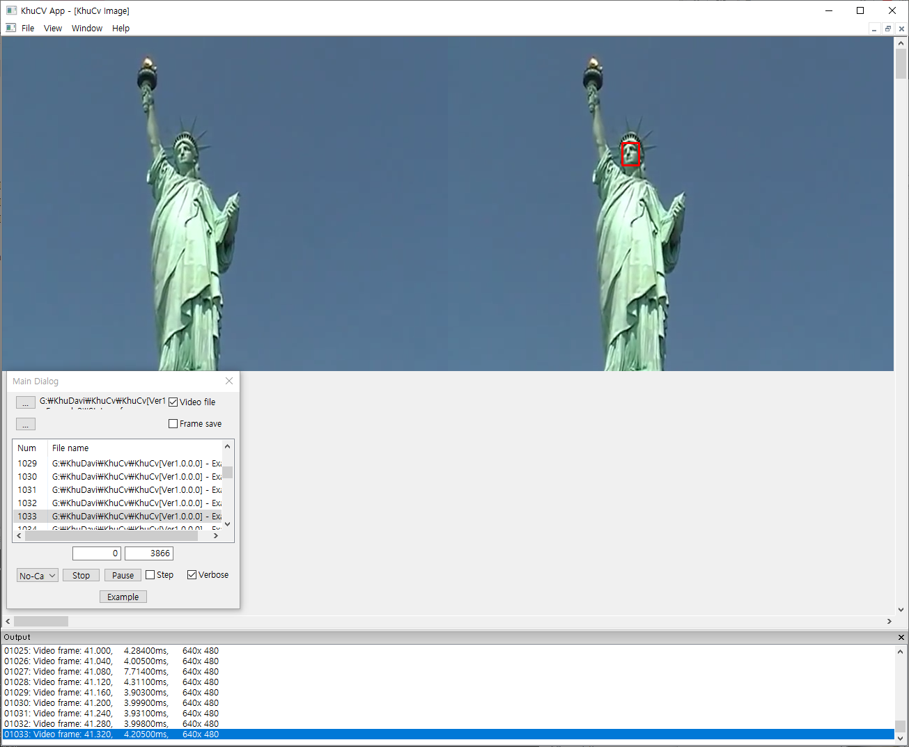

# Face detection example 
* Using Ultra-Light-Fast-Generic-Face-Detector-1MB (https://github.com/Linzaer/Ultra-Light-Fast-Generic-Face-Detector-1MB)
* Uinsg OpenCV (cv::dnn) - cv_dnn_ultraface.cpp/cv_dnn_ultraface.h (https://github.com/Linzaer/Ultra-Light-Fast-Generic-Face-Detector-1MB/tree/master/opencv_dnn)
* Model: version-slim-320_without_postprocessing.onnx (https://github.com/Linzaer/Ultra-Light-Fast-Generic-Face-Detector-1MB/tree/master/models/onnx)

## Project
* Copy cv_dnn_ultraface.cpp and cv_dnn_ultraface.h (https://github.com/Linzaer/Ultra-Light-Fast-Generic-Face-Detector-1MB/tree/master/opencv_dnn) to your project

## Project.h
``` C++
#include "cv_dnn_ultraface.h"

class CProject {
  // ...
	UltraFace *m_pUltraface;
};
```

## Project.cpp
``` C++
CProject::CProject() {
    GetExecutionPath();
    
    m_pUltraface = new UltraFace(m_ExePath, 320, 240);
}

CProject::~CProject() {
    delete m_pUltraface;
}

void CProject::Run(cv::Mat Input, cv::Mat& Output, bool bFirstRun, bool bVerbose) {
    std::vector<FaceInfo> faceList;
    m_pUltraface->detect(Input, faceList);
 
    cv::Mat OutImage = Input.clone();

    for(auto list : faceList) {
       cv::rectangle(OutImage, cv::Point(list.x1, list.y1), cv::Point(list.x2, list.y2), cv::Scalar(0, 0, 255), 2);
    }

    if(bVerbose)
        DisplayImage(OutImage, Input.cols, 0, false, true);
}
```

[Result]
</img>   

## References
* Ultra-Light-Fast-Generic-Face-Detector-1MB: https://github.com/Linzaer/Ultra-Light-Fast-Generic-Face-Detector-1MB
* The Common Objects in Context (COCO) images and Title-based Video Summarization (TVSum)/SumMe video files are used for demonstration.
* https://cocodataset.org/
* http://people.csail.mit.edu/yalesong/tvsum/
* https://gyglim.github.io/me/vsum/index.html
